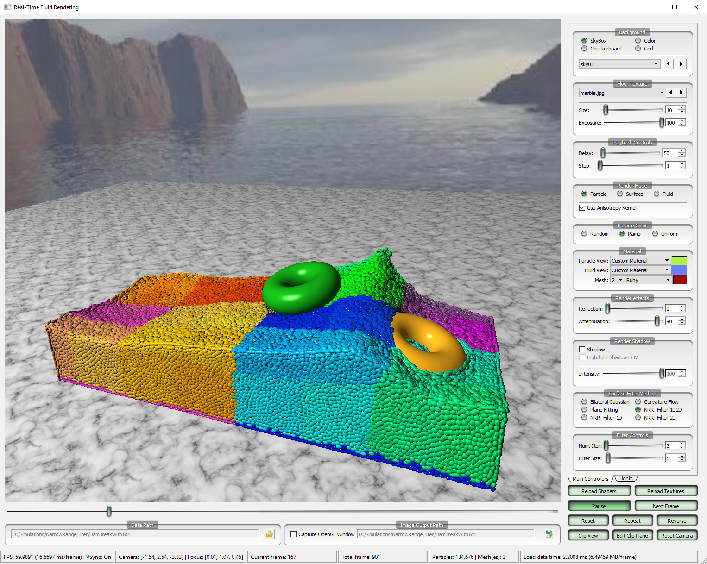
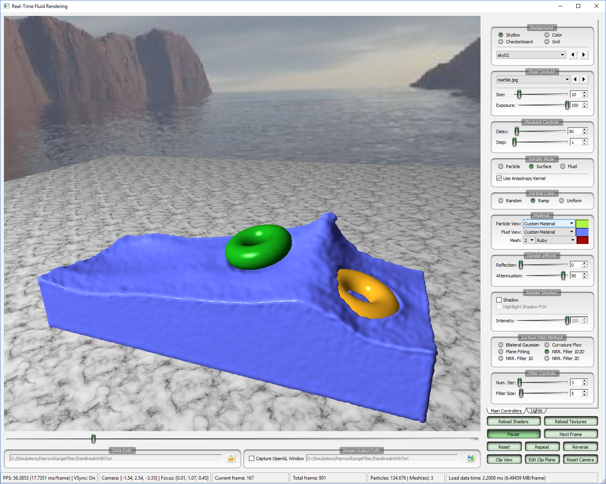
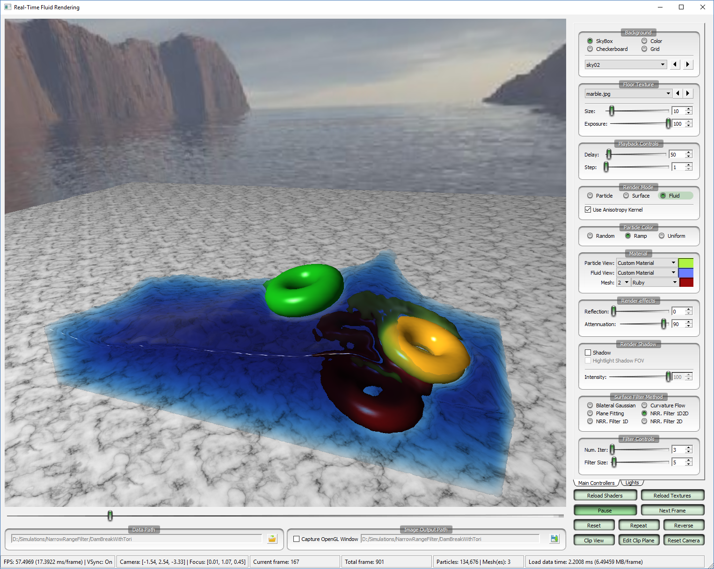
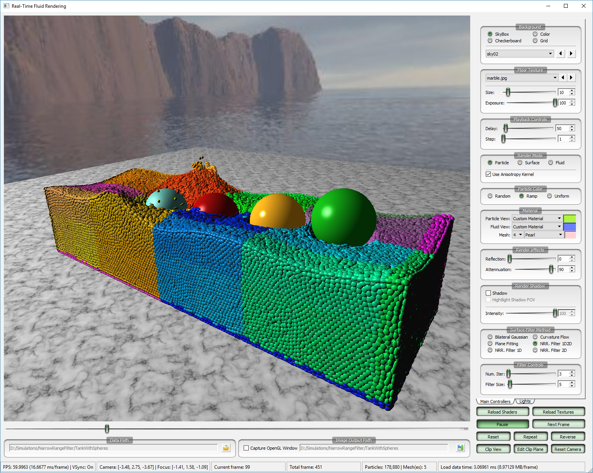
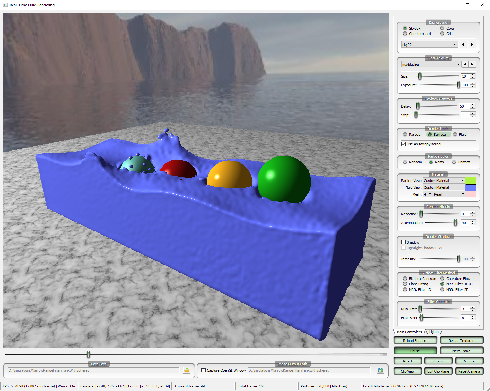
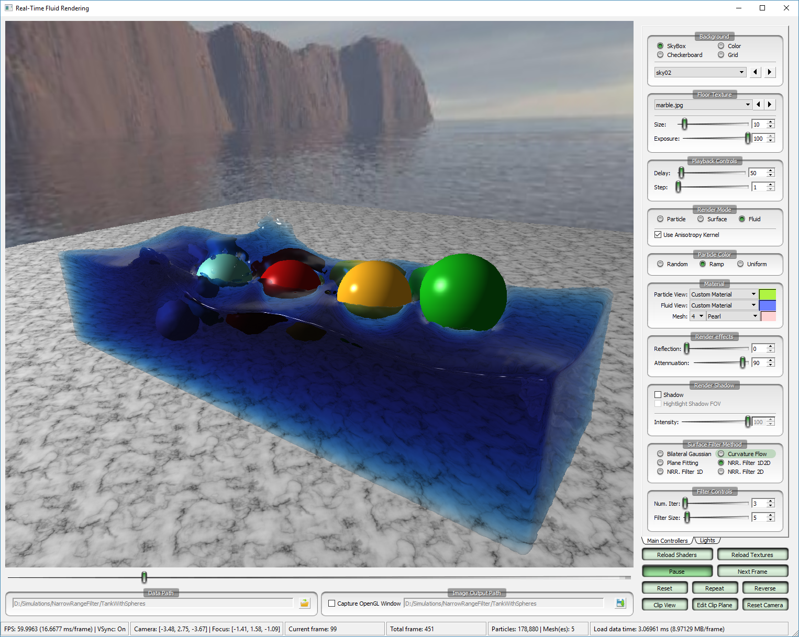

<p align="center">
<table style="border-collapse: collapse; border: none; width: 80%; margin-left:10%; margin-right:10%">
<tr>
<td></td>
<td></td>
<td></td>
</tr>
<tr>
<td></td>
<td></td>
<td></td>
</tr>
</table>
</p>

This is implementation of my i3D2018 paper "[A Narrow-Range Filter for Screen-Space Fluid Rendering](https://ttnghia.github.io/portfolio/narrow-range-filter/)". It is not the one that used in my paper but has been written from scratch for demonstration purpose and depends heavily on many external libraries, especially [Banana](https://github.com/ttnghia/Banana). Users should not expect to compile it by themselves but instead please download and run the provided binary (Windows | Mac) over the provided datasets.

### Download

* Windows/Mac binary and dataset: [https://github.com/ttnghia/RealTimeFluidRendering/releases](https://github.com/ttnghia/RealTimeFluidRendering/releases)


### Brief Usage
Firstly, one need to download and extract the provided datasets. For loading data, there are two ways:

* Modify the file "PlayList.txt" to the correct paths of the extracted data folders. Then just click into the corresponding line on the SimulationList window.
* From the main window, click the open icon of the "Data Path" box at the lower left corner and select a data folder.

Then, using program for rendering particle data is very straighforward.

### Textures
Skybox textures and floor textures are loaded from disk automatically at launching time. Users can modify textures to their own in the Textures folder. Note that each skybox texture needs to be put in a separate subfolder while all floor textures are put in the same folder.

### Data Format

Users can generate their own dataset similar to the provided one. Each dataset is a folder which has the following structure:
```
viz_info.txt
FluidFrame
...frame.%4d.pos
...frame.%4d.ani
SolidFrame
...frame.%4d.pos
```

**viz_info.txt** file contains simulation (number of particles, particle radius etc) and rendering information (light position, camera position etc), which can be inferred easily.

**FluidFrame/frame.%4d.pos** files contain particle positions, which have the following format:
```
Bytes 0-3(unsigned int): number of particles of the current frame
Bytes 4-7(float): particle radius
Next (4 x 3 x numParticles) bytes: array of particle positions
```

**FluidFrame/frame.%4d.ani** files contain particle anisotropic kernels, generated using the algorithm in the paper "[Reconstructing Surfaces of Particle-Based Fluids
Using Anisotropic Kernels](https://dl.acm.org/citation.cfm?id=2421641)". These files are **optional**, and have the following format:
```
Bytes 0-3(unsigned int): number of particles of the current frame
Next (4 x 9 x numParticles) bytes: array of 3x3 matrices (anisotropic kernels)
```


**SolidFrame/frame.%4d.pos** files contain triangle mesh objects in the following format:
```
BYTE 0-3(unsigned int): number of meshes
For each mesh i in numMeshes:
    Next 4 bytes(unsigned int): number of vertices of mesh[i]
    Next (4 x 3 x numVerticesOfMesh[i]) bytes: array of vertex positions of mesh[i]
    Next (4 x 3 x numVerticesOfMesh[i]) bytes: array of vertex normals of mesh[i]
```
